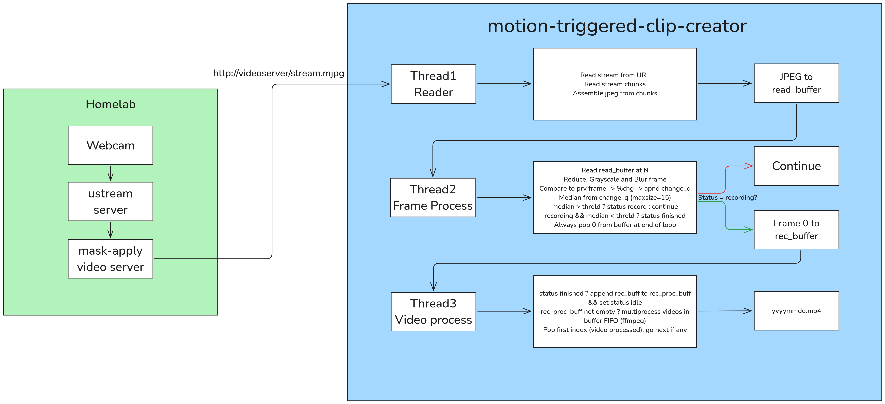

# Motion-triggered clip creator
This is a personal project meant to be integrated alongside my webcam video server
to create automatic clips triggered by motion.

> [!WARNING] DISCLAIMER
> 
> Camera is, of course, pointed at private property and with all public property
> masked with post-effects for privacy.

## Workflow
Visualized workflow below described by the image

Summarizing:
1. **Thread 1 - Stream reader**
   - We read streams from the URL.
   - We assemble a JPEG from each chunk.
   - We add the JPEG to `read_buffer`.
2. **Thread 2 - Frame Processing**
   - We read `read_buffer` at cursor N.
   - We apply a MOG2 to the image.
   - We compare this image to the current change median of last 15 frames.
     - If median > threshold we set status to record.
     - Otherwise, we continue.
   - If status is recording and median > threshold, we append frame to `rec_buffer`.
   - Otherwise, if median < threshold for 5s we set status to finished.
   - Pop frame at position 0 from `read_buffer` always at end of loop.
3. **Thread 3 - Video processing**
   - If status is set to finished, we append the current contents of `rec_buffer` to `rec_proc_buffer`
   and set status to idle.
   - If `rec_proc_buffer` is not empty, we process the frames at position 0 using ffmpeg + multiprocessing
   - After processing a video, we pop it from `rec_proc_buffer`.
   - If no videos in `rec_proc_buffer`, do nothing.